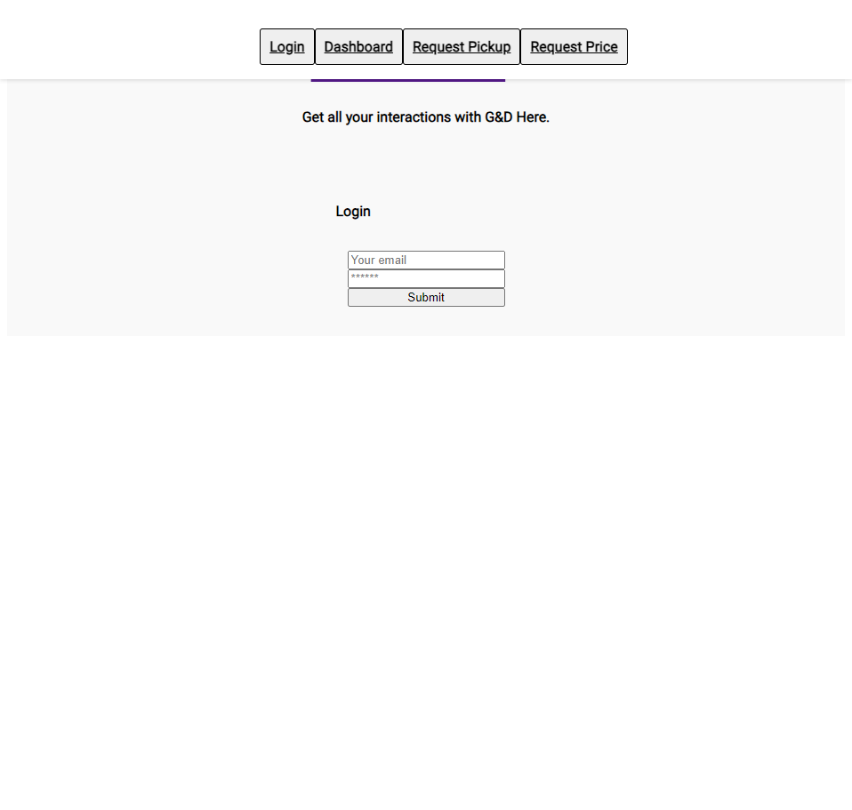

# Client Portal

## Description
A functional Client Portal for business accounts, documents, transactions, and multiple user request options such as: Pricing request, Appointment requests, etc.   
It also functions as a date scheduler pertaining to the business functions. With access upon request, users can keep track of the aforementioned features as well as to be able to upload vital information to the administrator.  
Aside from the user interface there is an admin interface for a superUser, this allows the administrator to respond and keep track of users accordingly making it a great tool to implement in a day to day business.  

## Deployed Application URL
https://clientportal.onrender.com/

## Screenshot

 

## Table of Contents
* [Features](#features)
* [Languages & Dependencies](#languagesanddependencies)
* [Usage](#HowtoUseThisApplication)
* [Contributors](#contributors)
* [License](#license)

## Features
A functional Client Portal that allows access and storage of business documents, transactions, and multiple user request options (pricing requests, appointment request, date scheduler). Also allows an admin user face that functions as an Administrator to respond to and keep track of users.  

## Languages & Dependencies
Mongoose, Graphql, Express, Apollo, nodemon, react

## Usage

Run npm i to install dependencies  
Run npm start to start the server

## Contributors
Amanda Corey  
Coral Darling  
Gustavo Duque  
Steven Lestrade 
Garrett Lieb 

## License
group project three; edX Full Stack Bootcamp; April, 2024

